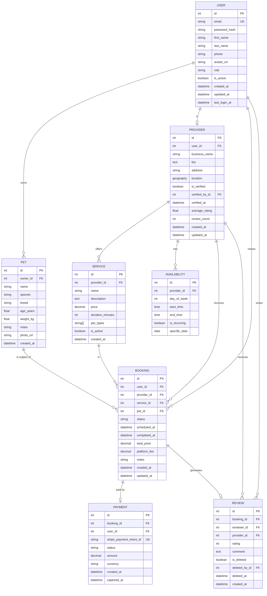

# =============================================================================
# Pepto — Database Documentation
# =============================================================================

This document describes the Pepto database schema, ER relationships, indexing strategy, migration workflow, and backup procedures.

**Database:** PostgreSQL 16 + PostGIS 3.4  
**ORM:** SQLAlchemy + Flask-Migrate (Alembic)  
**All timestamps:** stored in UTC (`TIMESTAMP WITH TIME ZONE`)

---

## Entity-Relationship Diagram



---

## Table Definitions

### `users`

Stores all registered accounts (pet owners, providers, admins).

| Column | Type | Constraints | Description |
|--------|------|-------------|-------------|
| `id` | `SERIAL` | PK | Auto-increment primary key |
| `email` | `VARCHAR(255)` | UNIQUE NOT NULL | Login email address |
| `password_hash` | `VARCHAR(255)` | NOT NULL | Bcrypt hash of password |
| `first_name` | `VARCHAR(100)` | NOT NULL | User's first name |
| `last_name` | `VARCHAR(100)` | NOT NULL | User's last name |
| `phone` | `VARCHAR(20)` | NULLABLE | E.164 format phone number |
| `avatar_url` | `TEXT` | NULLABLE | Cloudinary URL |
| `role` | `VARCHAR(20)` | NOT NULL DEFAULT `'user'` | `user`, `provider`, `admin` |
| `is_active` | `BOOLEAN` | NOT NULL DEFAULT `true` | Account active flag |
| `created_at` | `TIMESTAMPTZ` | NOT NULL DEFAULT `now()` | Account creation timestamp |
| `updated_at` | `TIMESTAMPTZ` | NOT NULL | Last profile update |
| `last_login_at` | `TIMESTAMPTZ` | NULLABLE | Last successful login |

---

### `pets`

Pet profiles associated with a user.

| Column | Type | Constraints | Description |
|--------|------|-------------|-------------|
| `id` | `SERIAL` | PK | — |
| `owner_id` | `INTEGER` | FK → users(id) ON DELETE CASCADE | Pet's owner |
| `name` | `VARCHAR(100)` | NOT NULL | Pet's name |
| `species` | `VARCHAR(50)` | NOT NULL | `dog`, `cat`, `bird`, etc. |
| `breed` | `VARCHAR(100)` | NULLABLE | Specific breed |
| `age_years` | `FLOAT` | NULLABLE | Age in years (decimal for puppies) |
| `weight_kg` | `FLOAT` | NULLABLE | Weight in kilograms |
| `notes` | `TEXT` | NULLABLE | Medical notes, temperament |
| `photo_url` | `TEXT` | NULLABLE | Cloudinary URL |
| `created_at` | `TIMESTAMPTZ` | NOT NULL DEFAULT `now()` | — |

---

### `providers`

Service provider profiles linked to a user account.

| Column | Type | Constraints | Description |
|--------|------|-------------|-------------|
| `id` | `SERIAL` | PK | — |
| `user_id` | `INTEGER` | FK → users(id) UNIQUE NOT NULL | One user = one provider profile |
| `business_name` | `VARCHAR(200)` | NOT NULL | Business or trading name |
| `bio` | `TEXT` | NULLABLE | Provider description |
| `address` | `TEXT` | NULLABLE | Full street address |
| `location` | `GEOMETRY(POINT, 4326)` | NULLABLE | PostGIS geographic point (lng, lat) |
| `is_verified` | `BOOLEAN` | NOT NULL DEFAULT `false` | Admin verified flag |
| `verified_by_id` | `INTEGER` | FK → users(id) NULLABLE | Admin who verified |
| `verified_at` | `TIMESTAMPTZ` | NULLABLE | Verification timestamp |
| `average_rating` | `NUMERIC(3,2)` | NULLABLE | Denormalised avg rating (0.0–5.0) |
| `review_count` | `INTEGER` | NOT NULL DEFAULT `0` | Denormalised total reviews |
| `created_at` | `TIMESTAMPTZ` | NOT NULL DEFAULT `now()` | — |
| `updated_at` | `TIMESTAMPTZ` | NOT NULL | — |

> **Why denormalise rating?** Computing `AVG(rating)` on every provider-list query is expensive. We maintain `average_rating` and `review_count` via triggers / application logic to keep list queries O(1).

---

### `services`

Individual service offerings by a provider (e.g., "30-min Dog Walk — $20").

| Column | Type | Constraints | Description |
|--------|------|-------------|-------------|
| `id` | `SERIAL` | PK | — |
| `provider_id` | `INTEGER` | FK → providers(id) ON DELETE CASCADE | Owning provider |
| `name` | `VARCHAR(200)` | NOT NULL | Service name |
| `description` | `TEXT` | NULLABLE | Detailed description |
| `price` | `NUMERIC(10,2)` | NOT NULL | Base price in USD |
| `duration_minutes` | `INTEGER` | NOT NULL | Expected service duration |
| `pet_types` | `TEXT[]` | NOT NULL DEFAULT `'{}'` | Accepted pet species |
| `is_active` | `BOOLEAN` | NOT NULL DEFAULT `true` | Soft-disable without deletion |
| `created_at` | `TIMESTAMPTZ` | NOT NULL DEFAULT `now()` | — |

---

### `availability`

Provider's available time windows.

| Column | Type | Constraints | Description |
|--------|------|-------------|-------------|
| `id` | `SERIAL` | PK | — |
| `provider_id` | `INTEGER` | FK → providers(id) ON DELETE CASCADE | — |
| `day_of_week` | `SMALLINT` | NULLABLE | 0=Monday…6=Sunday (for recurring) |
| `start_time` | `TIME` | NOT NULL | Slot start |
| `end_time` | `TIME` | NOT NULL | Slot end |
| `is_recurring` | `BOOLEAN` | NOT NULL DEFAULT `true` | Weekly recurring vs. one-off |
| `specific_date` | `DATE` | NULLABLE | Set when `is_recurring=false` |

---

### `bookings`

The core transaction record linking user, provider, service, and pet.

| Column | Type | Constraints | Description |
|--------|------|-------------|-------------|
| `id` | `SERIAL` | PK | — |
| `user_id` | `INTEGER` | FK → users(id) NOT NULL | Pet owner who booked |
| `provider_id` | `INTEGER` | FK → providers(id) NOT NULL | Service provider |
| `service_id` | `INTEGER` | FK → services(id) NOT NULL | Service being booked |
| `pet_id` | `INTEGER` | FK → pets(id) NOT NULL | Pet being cared for |
| `status` | `VARCHAR(30)` | NOT NULL DEFAULT `'pending'` | `pending`, `confirmed`, `in_progress`, `completed`, `cancelled`, `refunded` |
| `scheduled_at` | `TIMESTAMPTZ` | NOT NULL | Requested service datetime |
| `completed_at` | `TIMESTAMPTZ` | NULLABLE | Set when status → completed |
| `total_price` | `NUMERIC(10,2)` | NOT NULL | Price charged to user |
| `platform_fee` | `NUMERIC(10,2)` | NOT NULL | Pepto's cut |
| `notes` | `TEXT` | NULLABLE | Special instructions |
| `created_at` | `TIMESTAMPTZ` | NOT NULL DEFAULT `now()` | — |
| `updated_at` | `TIMESTAMPTZ` | NOT NULL | — |

---

### `payments`

Stripe payment records, one-to-one with a booking.

| Column | Type | Constraints | Description |
|--------|------|-------------|-------------|
| `id` | `SERIAL` | PK | — |
| `booking_id` | `INTEGER` | FK → bookings(id) UNIQUE NOT NULL | The booking being paid for |
| `user_id` | `INTEGER` | FK → users(id) NOT NULL | Payer |
| `stripe_payment_intent_id` | `VARCHAR(255)` | UNIQUE NOT NULL | Stripe PI id (`pi_...`) |
| `status` | `VARCHAR(30)` | NOT NULL | `pending`, `captured`, `failed`, `refunded` |
| `amount` | `NUMERIC(10,2)` | NOT NULL | Amount in USD |
| `currency` | `VARCHAR(3)` | NOT NULL DEFAULT `'usd'` | ISO 4217 currency code |
| `created_at` | `TIMESTAMPTZ` | NOT NULL DEFAULT `now()` | — |
| `captured_at` | `TIMESTAMPTZ` | NULLABLE | When the charge was captured |

---

### `reviews`

User reviews for completed bookings.

| Column | Type | Constraints | Description |
|--------|------|-------------|-------------|
| `id` | `SERIAL` | PK | — |
| `booking_id` | `INTEGER` | FK → bookings(id) UNIQUE NOT NULL | Only one review per booking |
| `reviewer_id` | `INTEGER` | FK → users(id) NOT NULL | Reviewing user |
| `provider_id` | `INTEGER` | FK → providers(id) NOT NULL | Reviewed provider |
| `rating` | `SMALLINT` | NOT NULL CHECK (1–5) | Star rating |
| `comment` | `TEXT` | NULLABLE | Written feedback |
| `is_deleted` | `BOOLEAN` | NOT NULL DEFAULT `false` | Soft delete flag |
| `deleted_by_id` | `INTEGER` | FK → users(id) NULLABLE | Admin who removed it |
| `deleted_at` | `TIMESTAMPTZ` | NULLABLE | — |
| `deletion_reason` | `TEXT` | NULLABLE | Admin's reason for removal |
| `created_at` | `TIMESTAMPTZ` | NOT NULL DEFAULT `now()` | — |

---

## Index Strategy

Indexes are chosen to optimise the most common query patterns:

| Table | Index Name | Columns | Type | Purpose |
|-------|-----------|---------|------|---------|
| `users` | `idx_users_email` | `email` | B-Tree UNIQUE | Login lookup |
| `users` | `idx_users_role` | `role` | B-Tree | Admin user filtering |
| `providers` | `idx_providers_location` | `location` | GiST | Geospatial radius search |
| `providers` | `idx_providers_verified` | `is_verified` | B-Tree | Filter verified providers |
| `providers` | `idx_providers_rating` | `average_rating DESC` | B-Tree | Sort by rating |
| `bookings` | `idx_bookings_user_id` | `user_id` | B-Tree | User's booking history |
| `bookings` | `idx_bookings_provider_id` | `provider_id` | B-Tree | Provider's booking queue |
| `bookings` | `idx_bookings_status` | `status` | B-Tree | Filter by status |
| `bookings` | `idx_bookings_scheduled_at` | `scheduled_at` | B-Tree | Calendar queries |
| `reviews` | `idx_reviews_provider_id` | `provider_id, is_deleted` | B-Tree | Provider reviews |
| `payments` | `idx_payments_stripe_pi` | `stripe_payment_intent_id` | B-Tree UNIQUE | Stripe webhook lookup |
| `pets` | `idx_pets_owner_id` | `owner_id` | B-Tree | User's pet list |

### Geospatial Query Example

```sql
-- Find all verified providers within 10 km of a point
SELECT p.*, 
       ST_Distance(p.location::geography, ST_MakePoint(77.5946, 12.9716)::geography) AS distance_m
FROM providers p
WHERE p.is_verified = true
  AND ST_DWithin(
        p.location::geography,
        ST_MakePoint(77.5946, 12.9716)::geography,
        10000   -- 10 km in metres
      )
ORDER BY distance_m ASC
LIMIT 20;
```

---

## Migration Instructions

Pepto uses **Flask-Migrate** (Alembic under the hood).

### Create a new migration

```bash
# After modifying a model
flask db migrate -m "add subscription_plan to providers"
```

### Review the generated migration

```bash
# Always review before applying!
cat migrations/versions/<revision>_add_subscription_plan_to_providers.py
```

### Apply migrations

```bash
# Development
flask db upgrade

# Production (via docker-compose)
docker compose exec backend flask db upgrade

# Or in CI/CD (from the deploy job)
ssh user@server "cd /opt/pepto && docker compose exec -T backend flask db upgrade"
```

### Rollback one migration

```bash
flask db downgrade -1
```

### Show migration history

```bash
flask db history
flask db current
```

### Initial database setup (first deploy)

```bash
# Enable PostGIS
docker compose exec postgres psql -U pepto_user -d pepto_db \
  -c "CREATE EXTENSION IF NOT EXISTS postgis;"

# Apply all migrations
docker compose exec backend flask db upgrade

# (Optional) Seed development data
docker compose exec backend flask seed-db
```

---

## Backup Procedures

### Manual backup

```bash
docker compose exec postgres \
  pg_dump -U pepto_user -d pepto_db \
  --format=custom \
  --compress=9 \
  > backups/pepto_$(date +%Y%m%d_%H%M%S).dump
```

### Restore from backup

```bash
# Drop and recreate the database
docker compose exec postgres \
  psql -U pepto_user -c "DROP DATABASE IF EXISTS pepto_db;"
docker compose exec postgres \
  psql -U pepto_user -c "CREATE DATABASE pepto_db;"

# Re-enable PostGIS
docker compose exec postgres \
  psql -U pepto_user -d pepto_db \
  -c "CREATE EXTENSION IF NOT EXISTS postgis;"

# Restore
docker compose exec -T postgres \
  pg_restore -U pepto_user -d pepto_db --no-owner --role=pepto_user \
  < backups/pepto_20260628_000000.dump
```

### Automated daily backup (cron)

```bash
# /opt/pepto/scripts/backup.sh
#!/bin/bash
set -euo pipefail

BACKUP_DIR=/opt/pepto/backups
DATE=$(date +%Y%m%d_%H%M%S)
FILE="$BACKUP_DIR/pepto_$DATE.dump"

mkdir -p "$BACKUP_DIR"

docker compose -f /opt/pepto/docker-compose.yml exec -T postgres \
  pg_dump -U pepto_user -d pepto_db --format=custom --compress=9 \
  > "$FILE"

echo "✅ Backup created: $FILE ($(du -sh "$FILE" | cut -f1))"

# Prune backups older than 14 days
find "$BACKUP_DIR" -name "*.dump" -mtime +14 -delete

# Upload to S3 (requires AWS CLI configured)
if command -v aws &> /dev/null; then
  aws s3 cp "$FILE" "s3://pepto-backups/postgres/$(basename "$FILE")" \
    --storage-class STANDARD_IA
  echo "☁️  Uploaded to S3"
fi
```

```bash
# Cron entry (run as ubuntu user): sudo crontab -e
0 2 * * * /opt/pepto/scripts/backup.sh >> /var/log/pepto-backup.log 2>&1
```

### Point-in-Time Recovery with WAL archiving (advanced)

For production systems requiring RPO < 1 day, configure PostgreSQL WAL archiving to S3 using **pgBackRest** or **WAL-G**. This allows recovery to any point within the retention window.

```bash
# Example WAL-G configuration
WALG_S3_PREFIX=s3://pepto-wal-archive
AWS_REGION=ap-south-1
PGHOST=localhost
PGUSER=pepto_user
```
